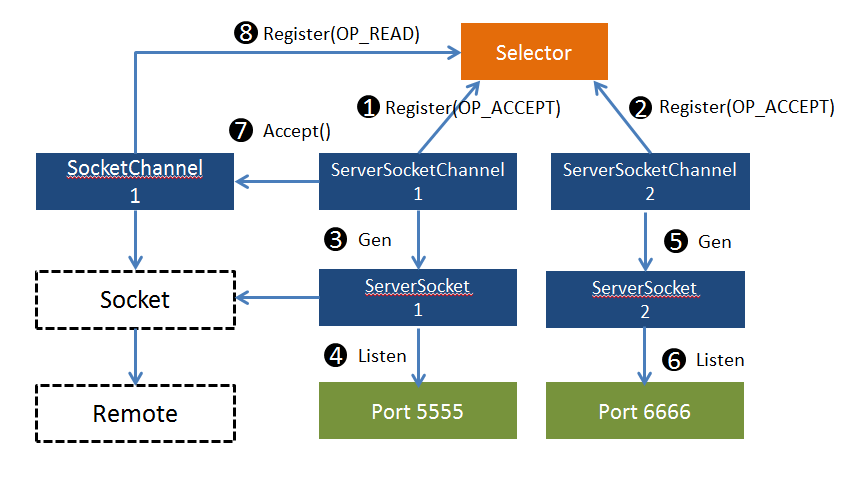

##NIO
本章翻译和总结自DevelopWorks的《Getting started with NIO》，介绍了Java NIO的主要原理。如有谬误，请发送pull request。  
<a name="AnchorIndex" id="AnchorIndex"></a>
Index:  
-[1.为什么要使用NIO](#Anchor1)  
-[2.NIO和传统IO的区别？](#Anchor2)  
-[3.Channels和Buffers](#Anchor3)  
-[4.如何分配Buffer，生成文件的管道，通过管道做文件IO？](#Anchor4)  
-[5.Buffer的内部实现](#Anchor5)  
-[6.分发和收集式NIO](#Anchor6)  
-[7.文件锁](#Anchor7)  
-[8.网络和异步I/O](#Anchor8)  
-[9.字符集](#Anchor9)  

-------
<a name="Anchor1" id="Anchor1"></a>
-**1.为什么要使用NIO**([Back to Index](#AnchorIndex))    
NIO把最耗费时间的IO行为转移到了操作系统因此提高了IO速度。

-------
<a name="Anchor2" id="Anchor2"></a>
-**2.NIO和传统IO的区别？**([Back to Index](#AnchorIndex))    
两者最重要的区别是如何封装数据和传输数据。

	* 传统IO：面向流，IO系统每次处理一个字节
	* NIO：面向块，IO系统每次处理一块数据

但现在的传统IO也有使用NIO的优良特性来优化自身的性能；使用NIO也可以很容的实现传统IO，——只要每次读写一个字节即可。

-------
<a name="Anchor3" id="Anchor3"></a>
-**3.Channels和Buffers**([Back to Index](#AnchorIndex))    
Channel和Buffer是NIO的核心类。传统IO使用两个Stream对象做对接，不经过中间介质；而NIO使用Buffer作为缓冲区，Channel的读写行为都发生在Buffer上，而不是另一个Channel上。

Buffer主要为Channel提供数据缓冲，但也提供直接对其内容操作的方法。Buffer追踪系统的读写进度。对于每个Java原语类型都有其对应的Buffer派生类，如ByteBuffer、CharBuffer和ShortBuffer等

Channel是为用户提供读写操作的对象，作用类似传统IO中的Stream对象，但Channel是双向的(可以从Buffer读或写)而Stream是单向的（需要把一个输入流和输出流关联起来）

-------
<a name="Anchor4" id="Anchor4"></a>
-**4.如何分配Buffer，生成文件的管道，通过管道做文件IO？**([Back to Index](#AnchorIndex))    
```java
ByteBuffer buffer = ByteBuffer.allocate(1024);//生成Buffer  
FileInputStream fin = new FileInputStream("input.txt");//生成输入流对象  
FileChannel fcin = fin.getChannel();//从输入流获取管道对象  
FileOutputStream fout = new FileOutputStream("output.txt");//生成输出流对象  
FileChannel fcout = fout.getChannel();//从输出流获取管道对象  
```

典型的buffer读写代码片段如下所示：  
```java
while(true){
     buffer.clear();//将position置为0，将limit置为buffer.capacity
     int r = fcin.read(buffer);//写buffer
     if(r = -1){
          break;
     }
     buffer.flip();//将position置为0，将limit置为之前position的值
     fcout.write(buffer);//读buffer
}
```

-------
<a name="Anchor5" id="Anchor5"></a>
-**5.Buffer的内部实现**([Back to Index](#AnchorIndex))   

	* 状态变量
		* position:指向有效数据区的尾部
		* limit：总是小于等于capacity，在读的情况下指向有效数据区的尾部，在写的情况下指向缓冲区的尾部
		* capacity：缓冲区的最大容量

	* clear()和flip()方法：
		* clear()使得position回到0，limit指向缓冲区尾部，为read（写）做准备
		* flip()使得position回到0，limit指向有效数据区的尾部，为write（读）做准备

	* get()和put()方法
		* 无论get还是put方法都分为绝对方法(指定了绝对位置)和相对方法，返回的ByteBuffer对象均为发生本次调用的对象自身
		* get()方法有四种形式
			* byte get();
			* ByteBuffer get(byte dst[]);
			* ByteBuffer get(byte dst[], int offset, int length);
			* byte get(int index);

		* put()方法有五种形式
			* ByteBuffer put(byte b);
			* ByteBuffer put(byte src[]);
			* ByteBuffer put(byte src[], int offset, int length);
		  * ByteBuffer put(ByteBuffer src);
		  * ByteBuffer put(int index, byte b);

		* get和put方法针对每种原语类型也有不同的实现

	* Direct Buffer，该缓冲区并不存在与堆上，使用native方法提高IO速度
	* Buffer对象生成方法
		* allocate(int size);//分配指定大小的Buffer
		* wrap(byte array[]);//将字节数组转换为Buffer
		* slice();//以当前的position为头，limit为尾切分出子Buffer，注意，子Buffer与原Buffer共享底层数据
		* asReadOnlyBuffer();//生成一个只读Buffer，只读Buffer不能被转换为可写Buffer
		* Memory-mapped file I/O，可以生成一个内存映射文件Buffer对象，避免对内存的读写而直接进行IO操作，提高了效率，但可能会有不安全因素
		* MappedByteBuffer mbb = fc. map(FileChannel.MapMode.READ_WRITE,0,1024);

-------
<a name="Anchor6" id="Anchor6"></a>
-**6.分发和收集式NIO**([Back to Index](#AnchorIndex))   
分发和收集式NIO利用两个Channel和一组Buffer实现数据的传输，具体实现方式是使用Channel的read(Buffer[])和write(Buffer[])，在read（写）时会顺序选择第一个可用的（剩余容量大于要写入块大小）的Buffer进行。应用场景如使用两个Buffer，一个Buffer为消息的header大小，另一个Buffer为消息的body大小，这样就能很自然的将两者分开读取。

-------
<a name="Anchor7" id="Anchor7"></a>
-**7.文件锁**([Back to Index](#AnchorIndex))   
文件锁的并不是用来阻止其他进程/线程对文件的访问，而是通过文件锁机制来实现系统不同部分的协调运转。通常可以为整个或部分文件加锁，文件锁分为互斥锁(exclusive lock)和共享锁(shared lock)，一个获取文件锁的操作示例如下：  
```java
RandomAccessFile raf = new RandomAccessFile("usefilelocks.txt","rw");//互斥锁要求必须打开w选项（因为写互斥是OS支持的）
FileChannel fc = raf.getChannel();
FileLock lock = fc.lock(start,end,false);
// ...
lock.release();//释放锁
```
文件锁需要谨慎使用，使用建议：

	* 只使用互斥锁
	* 将锁看做是建议性的

-------
<a name="Anchor8" id="Anchor8"></a>
-**8.网络和异步I/O**([Back to Index](#AnchorIndex))   
异步I/O实现了数据的无阻塞读写操作，其核心类包括Selector,ServerSocketChannel,SocketChannel和SelectionKey以及ByteBuffer。  

下图展示了NIO典型工作过程

  

如下github链接是一个典型的NIO实现  
  `https://github.com/yangwm/JavaLearn/blob/master/src/jnio/MultiPortEcho.java`  

可用的注册事件名和对应值  

	* 服务端接收客户端连接事件 SelectionKey.OP_ACCEPT(16)
	* 客户端连接服务端事件 SelectionKey.OP_CONNECT(8)
	* 读事件 SelectionKey.OP_READ(1)
	* 写事件 SelectionKey.OP_WRITE(4)

在实际应用中，可能需要将Channel从Selector的注册表中移出，同时使用多线程来处理收到的数  

NIO比BIO的在某些情况下还更差一些，因为这里需要使用两个system call (select 和 recvfrom)，而BIO只调用了一个system call (recvfrom)。但是，用select的优势在于它可以同时处理多个连接。所以如果处理的连接数不是很高的话，使用select/epoll的web server不一定比使用multi-threading + blocking IO的web server性能更好，可能延迟还更大。select/epoll的优势并不是对于单个连接能处理得更快，而是在于能处理更多的连接。

-------
<a name="Anchor9" id="Anchor9"></a>
-**9.字符集**([Back to Index](#AnchorIndex))   
使用CharsetDecoder和CharsetEncoder可以在CharBuffer和ByteBuffer之间做转换，如:  
```java
Charset latin1 = Charset.forName("ISO-8859-1");
CharsetDecoder decoder = latin1.newDecoder();
CharsetEncoder encoder = latin1.newEncoder();
ByteBuffer inputData;
CharBuffer cb = decoder.decode(inputData);
ByteBuffer outputData = encoder.encode(cb);
```

